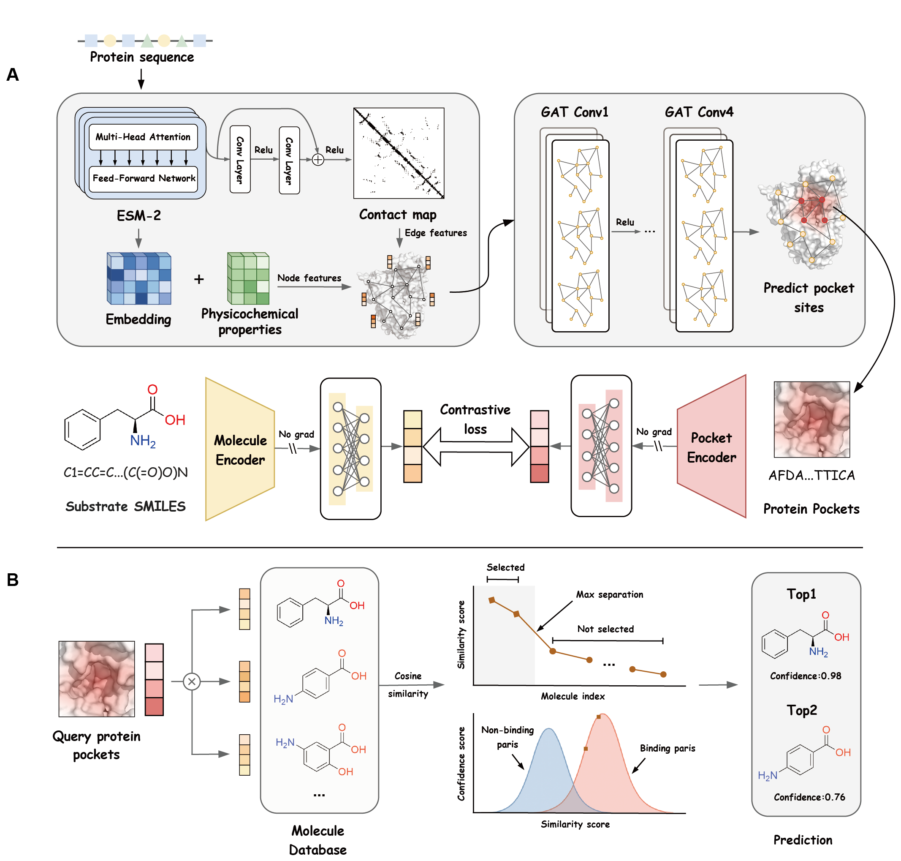
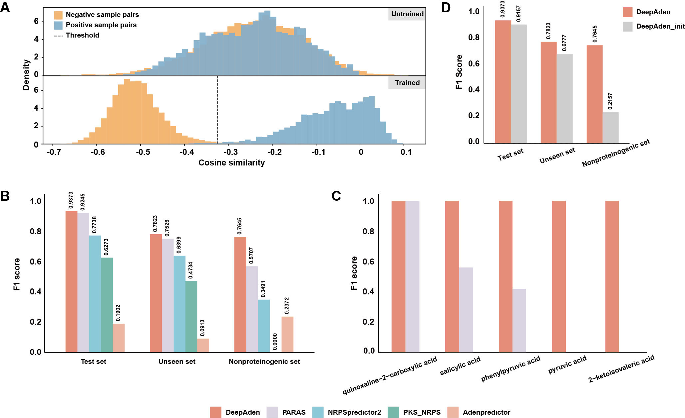

 

*Adenylation Domains Substrate Specificity Prediction Using Deep Learning*

#

**DeepAden** is an ensemble deep learning model designed to predict adenylation (A) domain substrate specificity. The framework first trains a graph attention network to identify the A-domain binding pocket surrounding the substrate, using fused sequence and structural features derived from a protein language model. It then employs cross-modal contrastive learning to jointly encode pocket-substrate interactions through protein and chemical language models, effectively addressing challenges such as substrate promiscuity and zero-shot prediction. DeepAden has been converted into an easy-to-use web server, available at [https://deepnp.site/](https://deepnp.site/).



## Overview

The DeepAden framework integrates two core predictive models:

- **Pocket prediction model**: Takes A-domain amino acid sequences as input and predicts the corresponding 27-amino-acid (AA) substrate-binding pocket residues.
- **Substrate prediction model**: Evaluates binding probabilities between predicted pockets and molecules in a compound database, and employs either a max-separation or top-k algorithm for candidate selection, with prediction confidence quantified through Gaussian Mixture Modeling (GMM) to ensure reliable results.



Features:

- **Superior predictive performance**: DeepAden demonstrats better performance than currently published tools, particularly in handling highly divergent A-domains with enhanced robustness.
- **Flexible output options**: Users can select between max-separation (max-sep) or top-k to obtain prediction results, and quantify the confidence score of the results.
- **Effective poly-substrate prediction**: DeepAden shows remarkable capability in predicting substrate promiscuity, successfully validating multiple poly-substrate cases in experimental studies.

1. [Getting Started](#getting-started)
2. [Data](#data)
3. [Usage](#usage)
4. [Results](#results)

## Getting Started

### Model weights

Before using DeepAden, you need to download two pretrained models and place them in the `models`directory: [ESM2](https://huggingface.co/facebook/esm2_t33_650M_UR50D/tree/main) and [MoLFormer](https://huggingface.co/ibm/MoLFormer-XL-both-10pct/tree/main). You can find other weights required for inference in the same directory.

### Installation

DeepAden requires Python 3.8+ and several dependencies. We recommend using conda to manage the environment. All required packages can be installed using the provided `environment.yml` file. To set up the environment, follow these steps:

Clone the repository

```
git clone https://github.com/Qinlab502/DeepAden
cd DeepAden
```

Create and activate conda environment

```
conda env create -f environment.yml
conda activate DeepAden
```

## Data

The `data` directory contains two essential files:

- `mol_db.csv`：A comprehensive database of known A-domain substrates curated from MIBiG databases and literatures.
- `reference.csv`: A benchmark correction file for binding pocket prediction.

**Note**: After initial execution, DeepAden automatically generates a `molecule_data` subdirectory containing feature embedding vectors for all molecules in the database. If you wish to update the substrate database, you can upload the new `mol_db.csv` file and delete the existing `molecule_data` folder, then rerun DeepAden again.

The `example` directory contains FASTA files of A-domain amino acid sequences to be predicted, serving as input files for the model.

## Usage

The run_DeepAden.sh script is provided to execute the complete DeepAden prediction pipeline, supporting parameter configurations including input FASTA file path (-f), output directory (-o), selection algorithm (-k, max-sep or top-k), and number of threads (-n). Detailed usage can be viewed via ./run_DeepAden.sh -h

```
Usage: run_DeepAden.sh -f <fasta_file> [-o <output_dir>] [-p <plm_path>] [-c <cm_path>] [-r <reference_csv>] [-n <processes>] [-m] [-k <top_k>]

Options:
  -f <fasta_file>      Path to the input FASTA file (required)

  -o <output_dir>      Path to the output directory (default: DeepAden/results)

  -p <plm_path>        Path to the pre-trained model weights (default: DeepAden/model/esm2_t33_650M_UR50D)

  -c <cm_path>         Path to the contact map model (default: DeepAden/model/contact_prediction_sigmoid_1024_0.65_1553.pth)

  -r <reference_csv>   Path to the reference CSV file (default: DeepAden/data/reference.csv)

  -m                   Use maximum separation method (default: true)

  -k <top_k>           Use top-k method with specified k value (default: 10)

  -n <processes>       Number of processes (default: 12)

Note: By default uses maximum separation method. Specify -k to use top-k instead.
```

The default parameters are optimized for common use cases. For standard analysis using max-separation algorithm, simply specifying the input file suffices. To obtain top-k predictions, additionally provide the `-k` parameter to define the number of results.

```
sh run_DeepAden.sh -f adomain.fasta [-k 5]
```

## Results

The `results` directory contains all output files generated by the model, with two key result files (Note: other intermediate files generated during model execution are also included in this directory):

- `ABP_predictions.csv`：Predicted A-domain binding pockets as shown in the table below. The last column shows predicted pocket sequences. Positions correspond to annotated regions in target_1-4. The labels column can be ignored when substrates are unknown.

| id                      | region_1    | region_2 | region_3 | region_4    | binding_pocket_positions                                                                                    | domain_sequence     | binding_pocket              |
| ----------------------- | ----------- | -------- | -------- | ----------- | ----------------------------------------------------------------------------------------------------------- | ------------------- | --------------------------- |
| ctg1_4534_AMP-binding_1 | A---FDAA-WE | ATIP     | VVAGE    | AVGPTETTVCA | 194,198,199,200,201,203,204,241,242,243,244,263,264,265,266,267,286,287,288,289,290,291,292,293,294,295,296 | FAERVRRHPEAVALVH... | AFDAAWEATIPVVAGEAYGPTETTVCA |
| ctg1_4534_AMP-binding_2 | T---FDVS-QE | LYAP     | AQAGE    | HVGPTESHVIT | 191,195,196,197,198,200,201,238,239,240,241,266,267,268,269,270,293,294,295,296,297,298,299,300,301,302,303 | FQRQAHALPGTPAVV...  | TFDVSQELYAPAQAGEHYGPTESHVIT |
| ctg1_4534_AMP-binding_3 | A---FDAA-LE | AFLT     | VVGGE    | VYGPTETTCVA | 184,188,189,190,191,193,194,231,232,233,234,253,254,255,256,257,276,277,278,279,280,281,282,283,284,285,286 | AGWAARTPDAPALLA...  | AFDAALEAFLTVVGGEVYGPTETTCVA |

- `output.csv`: Predicted A-domain substrates as shown in the table below. The table presents candidate substrate molecules with their confidence scores in descending prediction order (left→right, generated by max-separation algorithm up to 3 molecules), where blank entries indicate no valid prediction at that rank.

| protein_id              | molecule_1    | confidence_score_1 | molecule_2           | confidence_score_2 | molecule_3        | confidence_score_3 |
| ----------------------- | ------------- | ------------------ | -------------------- | ------------------ | ----------------- | ------------------ |
| ctg1_4534_AMP-binding.1 | phenylalanine | 1                  | dl-homophenylalanine | 1                  | tyrosine          | 0.9997             |
| ctg1_4534_AMP-binding.2 | proline       | 1                  | 4r-methylproline     | 0.9991             | 4r-hydroxyproline | 0.9907             |
| ctg1_4534_AMP-binding.3 | leucine       | 1                  |                      |                    |                   |                    |

