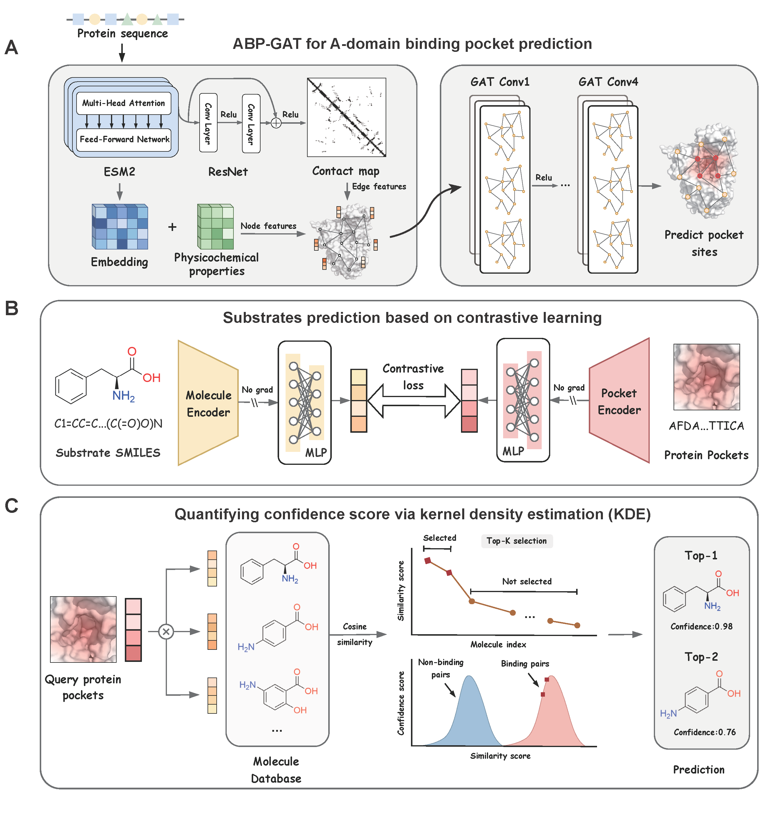
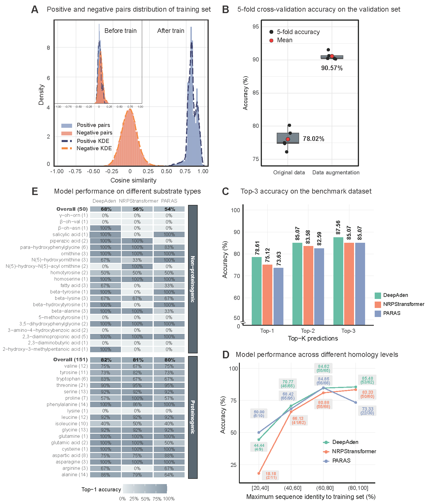

 

*Adenylation Domains Substrate Specificity Prediction Using Deep Learning*

#

DeepAden has been converted into an easy-to-use web server, available at [https://deepnp.site/](https://deepnp.site/).



**DeepAden** is an ensemble deep learning model designed to predict adenylation (A) domain substrate specificity in nonribosomal peptide synthetases. The model employs a two-stage architecture: first, a graph attention network identifies A-domain binding pockets by integrating sequence and structural features derived from protein language models; second, cross-modal contrastive learning jointly encodes pocket–substrate interactions through protein and chemical language models. DeepAden achieves competitive performance against state-of-the-art methods on benchmark datasets, with particular strength in predicting nonproteinogenic substrates. This framework offers a practical solution for binding pocket localization and substrate prediction, potentially accelerating the discovery and characterization of novel NRP natural products.

## Overview

The DeepAden framework integrates two core predictive models:

- **Pocket prediction model**: Takes A-domain amino acid sequences as input and predicts the corresponding 27-amino-acid (AA) substrate-binding pocket residues.
- **Substrate prediction model**: Evaluates binding probabilities between predicted pockets and molecules in a compound database, and employs top-k algorithm for candidate selection, with prediction confidence quantified through Kernel Density Estimation (KDE) to ensure reliable results.



Features:

- **Superior predictive performance**: DeepAden outperforms existing tools in substrate specificity prediction, particularly for nonproteinogenic substrates. The model also exhibits strong generalization and robustness across A-domains with varying sequence identity to the training set.
- **Flexible input and output options**: DeepAden accepts multiple input formats, including FASTA files containing amino acid sequences, GenBank files (e.g., antiSMASH output), and genome files. Users can customize the k value to control the number of predicted substrates returned.
- **Genome-wide prediction visualization**: When using genome files as input, DeepAden visualizes the predicted NRPS biosynthetic gene clusters, displaying core modules and their arrangement. Users can intuitively examine the predicted substrate for each A-domain along with its relative position within the gene cluster.

- [](#)
  - [Overview](#overview)
  - [Getting Started](#getting-started)
    - [Model weights](#model-weights)
    - [Installation](#installation)
  - [Data](#data)
  - [Usage](#usage)
  - [Results](#results)

## Getting Started

### Model weights

Before using DeepAden, you need to download two pretrained models and place them in the `models`directory: [ESM2](https://huggingface.co/facebook/esm2_t33_650M_UR50D/tree/main) and [MoLFormer](https://huggingface.co/ibm/MoLFormer-XL-both-10pct/tree/main). You can find other weights required for inference in the same directory.

### Installation

DeepAden requires Python 3.10+ and several dependencies. We recommend using conda to manage the environment. All required packages can be installed using the provided `environment.yml` file. To set up the environment, follow these steps:

Clone the repository

```
git clone https://github.com/Qinlab502/DeepAden
cd DeepAden
```

Create and activate conda environment

```
conda env create -f environment.yml
conda activate DeepAden
```

## Data

The `data` directory contains essential files for model execution and other supplementary files:

- `mol_db.csv`：A comprehensive database of known A-domain substrates curated from MIBiG databases and published literature.
- `template_correction.csv`: A benchmark correction file for binding pocket prediction.
- `AMP-binding`, `nrps_domains`: The raw HMM file for AMP-binding family and NRPS domains.
- `train_set.csv`：The train dataset used by Deepaden (after data augmentation).
- `Streptomyces hygroscopicus OsiSh 2.fasta`, `BGC-4.24.gbk`, `BGC-4.8,gbk`: The genome file of *Streptomyces hygroscopicus* OsiSh-2, along with biosynthetic gene cluster files for nyuzenamides(BGC-4.24) and octaminomycins(BGC-4.8) described in the manuscript.

**Note**: After initial execution, DeepAden automatically generates a `molecule_data` subdirectory containing feature embedding vectors for all molecules in the database. If you wish to update the substrate database, you can upload the new `mol_db.csv` file and delete the existing `molecule_data` folder, then rerun DeepAden again.

The `example` directory contains sample input files in each supported format for testing the model.

## Usage
Before using DeepAden for the first time, the HMM files needs to be decompressed using the `hmmpress` command.

```
hmmpress data/AMP-binding/PF00501.hmm
hmmpress data/nrps_domains/nrpspksdomains.hmm
```

The run_DeepAden.sh script is provided to execute the complete DeepAden prediction pipeline, supporting parameter configurations including input FASTA file path (-f), GBK file (-g), genome file (-G), top_k (-k), output directory (-o), and number of threads (-n). Detailed usage can be viewed via ./run_DeepAden.sh -h

```
Usage: run_DeepAden.sh (-f <fasta_file> | -g <gbk_file> | -G <genome_fasta>) [-o <output_dir>] [-p <plm_path>] [-c <cm_path>] [-d <binding_model_dir>] [-r <reference_csv>] [-n <processes>] [-k <top_k>] [-m <model_weight_name>]

Input Options (choose one):
  -f <fasta_file>           Path to the input protein FASTA file

  -g <gbk_file>             Path to the input GBK file

  -G <genome_fasta>         Path to the input genome FASTA file (nucleotide)

Other Options:
  -o <output_dir>           Path to the output directory

  -p <plm_path>             Path to the pre-trained PLM weights

  -c <cm_path>              Path to the contact map model

  -d <binding_model_dir>    Directory containing binding prediction weights

  -r <reference_csv>        Path to the reference CSV file

  -k <top_k>                Use top-k method with specified k value (default: 3)

  -n <processes>            Number of processes (default: 12)
  
  -m <model_weight_name>    Model weight to use: all.weight or benchmark.weight (default: all.weight)

Note: Only the input file (-f, -g, or -G) is required; all other parameters are optional with optimized defaults for common use cases.
```

## Results

The `results` directory contains all output files generated by the model, with three key result files (Note: All intermediate files produced during model execution are saved in this directory and will be automatically cleaned up once the process finishes.):

- `ABP_predictions.csv`：Predicted A-domain binding pockets as shown in the table below. The last column shows predicted pocket sequences. Positions correspond to sequence in binding_pocket.

| id | region_1 | region_2 | region_3 | region_4 | binding_pocket_positions | domain_sequence | binding_pocket |
|---|---|---|---|---|---|---|---|
| ctg1_4534_AMP-binding.1\|1-349 | A---FDAA-WE | ATIP | VVAGE | AYGPTETTVCA | 194,198,199,200,201,203,204,241,242,243,244,263,264,265,266,267,286,287,288,289,290,291,292,293,294,295,296 | FAERVRRHPEAVALVHEDRTLSYAELDRRANRLARALIERGVGPEQVVALALDRSPELVVAMLAVLKAGAAYLPVDTSYPADRIAYLLTDAAPALVLTTAGSAGLIPDARTAPPLALDDPDTARWIEDRPDSALGPRELLGVVTPECAAYVIYTSGSTGRPKGVVVTHRGLAGLVTTHVERFGVGPGSRVLQFASPSFDAAVWETYMALLTGAALVLAPAERLRPGRALADLAAEQRVTHATIPPAALAVLDPGDLPTVRVLVVAGEAAAPELVQAWSTGRRMFNAYGPTETTVCASMSDPLEGTGPPPIGTAIGTARLRVLDGALRPVPPGVTGELYISGPCLARGYL | AFDAAWEATIPVVAGEAYGPTETTVCA |
| ctg1_4534_AMP-binding.2\|1-359 | T---FDVS-QE | LYAP | AQAGE | HYGPTESHVIT | 191,195,196,197,198,200,201,238,239,240,241,266,267,268,269,270,293,294,295,296,297,298,299,300,301,302,303 | FQRQAHALPGTPAVVHGDTALSYAELNARANRLARLLLARGIGPEDVVGVALPRSVDLLVAVVAVVKAGAAYLPIDPGYPTERVSFMLADAAPAVVLTRGGVLPDGVRAPVLALDEPETAQALAAQRDTDPTDADRPRPLHPAAPVYVIHTSGSTGRPKGVVMPAGAMANLVAWHHDEIGGGAGTRVAQFTAISFDVSAQEILATLLTGKTLVVPDDAVRRDAAALTRWLEEHRINELYAPNLVVDAVAEAALESGAALAELRVIAQAGEALALTPRLRAFCAGRPGLRLHNHYGPTESHVITATTLPADPAEWPATAPIGRPVWNDRVYVLDDTLGPVPPGVVGELYLAGTGLARGYL | TFDVSQELYAPAQAGEHYGPTESHVIT |
| ctg1_4534_AMP-binding.3\|3-339 | A---FDAA-LE | AFLT | VVGGE | VYGPTETTCVA | 182,186,187,188,189,191,192,229,230,231,232,251,252,253,254,255,274,275,276,277,278,279,280,281,282,283,284 | WAARTPDAPALLAGDRTWTFAELHARVERIARSLAARGAGPEKLVAVALPRSPELIVSLLAVVRTGAAYLPVNPELPGDRIGYMLDDARPALLLTSGPVAGRLPRTTVPTARYDALEAERTADAAVLPHNLSPQHPAYVIYTSGSTGRPKGVTVTHAGVARLCATLVERAGVGPGARVPQLASVSFDAAFLELAMSLLTGGALVVVPADRPASGQAYLDLCAEYGVTHAFLTPASLAALPEGGLPEGMEIVVGGESFGPELIGRWRHTVRLHNVYGPTETTCVAAMSGLLTDDAVPALGAPVADSRLHVLDTRLRPVPLGCVGELHIAGASLARGYL | AFDAALEAFLTVVGGEVYGPTETTCVA |

- `substrate_prediction_top3_all_weight.csv`: Predicted A-domain substrates are shown in the table below. Candidate substrates are ranked by confidence score in descending order from left to right (top-3 predictions).

| id | Top1 | Top1_score | Top2 | Top2_score | Top3 | Top3_score |
|---|---|---|---|---|---|---|
| ctg1_4534_AMP-binding.1\|1-349 | phenylalanine | 0.99 | 4-(dimethylamino)phenylalanine | 0.05 | phenylglycine | 0.02 |
| ctg1_4534_AMP-binding.2\|1-359 | proline | 1.0 | 4-methylproline | 0.15 | pipecolic acid | 0.02 |
| ctg1_4534_AMP-binding.3\|3-339 | leucine | 1.0 | isoleucine | 0.16 | homoleucine | 0.01 |


- `substrate_prediction_top3_all_weight.json`: Present the above output results in JSON file format.
